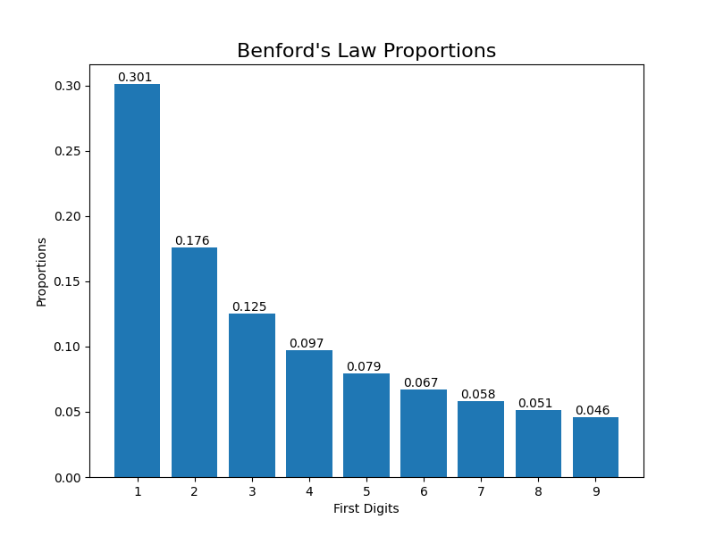

# stocks-benford-law
Here, we aim to investigate Benford's Law and its applicability to certain stocks.

**Benford's Law** is an observation about the frequency distribution of leading digits of many real-life sets of numerical data. In simple terms, it states that in many datasets, most elements (around 30%) will have 1 as the first digit, then next (around 17%) will have 2 as the first digit, and so on, with a decreasing trend until 9, of which only 4.9% of elements in the dataset will have it as its first digit.

Mathematically, these numbers are seen to follow the formula P(d) = log_10(d+1) - log_10(d). Here, P(d) is the probability of d being the first digit.

A graphical view of the proportions can be found below.

## I. Data Description:
- `s&p500_dist.csv` -- This file contains the distributions (counts) of how many times each digit appears as the first digit in the stock's closing price.
- `s&p500_dist.csv` -- This is similar to the aforementioned file, except the counts are converted to percentages.

## II. Code:
General overview of the dataset (and breakdown by sector):

`python eval.py`

Full history of individual stock:

`python indiv_stock.py --stock=(symbol)`

### III. Todo:
- [ ] Code cleanup
- [ ] Fix the metric
- [ ] Get distribution by date (and some preliminary analysis)
- [ ] Volatility implementation
- [ ] Correlation study between volatility and Benford scores
- [ ] Do Benford analysis on other data (e.g. returns)
